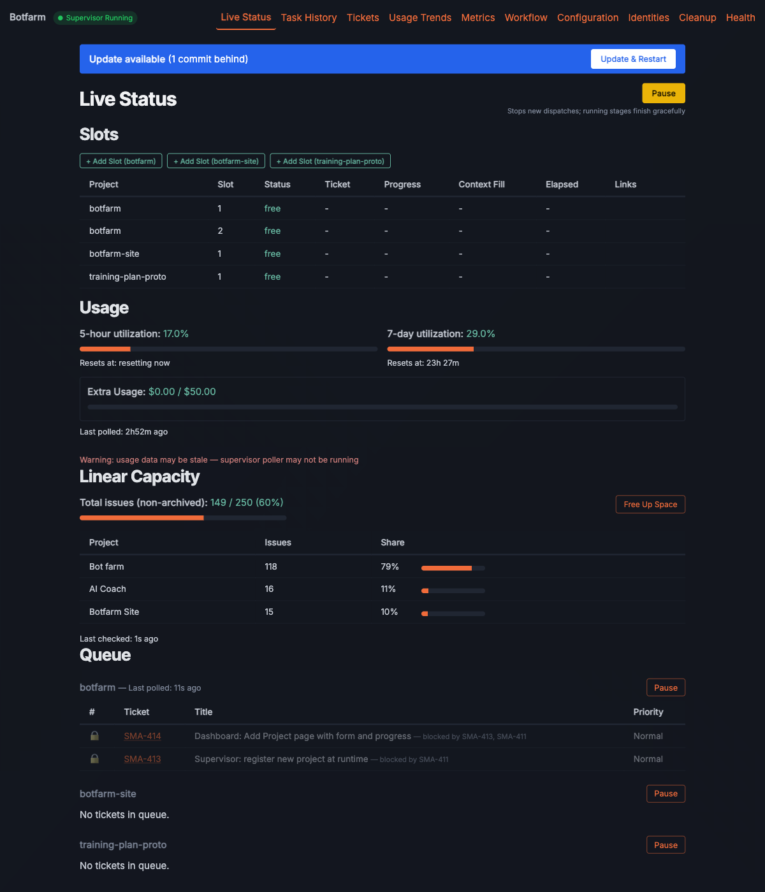
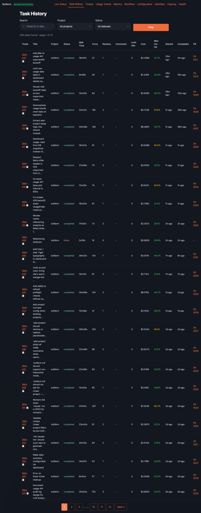

# Botfarm

**[botfarm.run](https://botfarm.run)**

Autonomous Linear ticket dispatcher for Claude Code agents.

Botfarm polls your Linear board for "Todo" tickets, dispatches them to Claude Code agent workers running in parallel git worktrees, and manages the full pipeline: implement → review → fix → PR checks → merge.

## Dashboard





## Prerequisites

### System Requirements

- **Python 3.12+**
- **Node.js 18+** (Linear MCP tools are launched via `npx`)
- **git**
- **4 GB+ RAM** recommended (2 GB is marginal with Claude Code running)

### Claude Code

Install using the standalone installer:

```bash
curl -fsSL https://claude.ai/install.sh | bash
```

> **Note:** Use `| bash`, not `| sh` — the latter fails on Ubuntu.

> **Important:** The installer places `claude` in `~/.local/bin`, which may not be in your PATH. Add it now — without this step, `botfarm run` will fail with "claude not found":

```bash
echo 'export PATH="$HOME/.local/bin:$PATH"' >> ~/.bashrc
source ~/.bashrc
```

**Node.js** is required — Linear MCP tools are launched via `npx` at runtime.

### GitHub CLI

**Ubuntu 24.04:** The official apt repository may have GPG key issues. Use a direct `.deb` install instead:

```bash
GH_VERSION=$(curl -s https://api.github.com/repos/cli/cli/releases/latest | grep '"tag_name"' | sed 's/.*v//' | sed 's/".*//')
curl -fsSL "https://github.com/cli/cli/releases/download/v${GH_VERSION}/gh_${GH_VERSION}_linux_amd64.deb" -o /tmp/gh.deb
sudo dpkg -i /tmp/gh.deb
```

**Other systems:** Follow the [official instructions](https://github.com/cli/cli#installation).

Then authenticate:

```bash
gh auth login
```

Select the **SSH** protocol when prompted. This automatically generates and uploads an SSH key — no manual `ssh-keygen` needed.

### GitHub SSH Host Key

On fresh machines, add GitHub's host key before cloning repos:

```bash
ssh-keyscan github.com >> ~/.ssh/known_hosts
```

### Linear API Key

Create a personal API key at [Linear Settings → API](https://linear.app/settings/api). You'll add this during setup. This key is used for both the supervisor (polling tickets, updating status) and the agent workers (Linear MCP tools are auto-configured via `--mcp-config`).

## Headless Server Setup

When running on a headless server (no browser), authentication requires two browser-based steps. Each uses a device/authorization code flow — you'll see a URL and code on the server, then complete auth in any browser.

### Step 1: Claude Code Auth

```bash
claude
```

1. A URL and one-time code are displayed
2. Open the URL in a browser on any machine, enter the code
3. Authentication completes on the server

### Step 2: GitHub CLI Auth

```bash
gh auth login
```

1. Select **GitHub.com**
2. Select **SSH** protocol
3. Select **Login with a web browser**
4. A one-time code is displayed — open the URL on any machine and enter it

## Setup

```bash
git clone https://github.com/AlexDobrushskiy/botfarm.git
cd botfarm
python3 -m venv .venv
source .venv/bin/activate
pip install -r requirements.txt
pip install -e .
```

## Configuration

### Quick start (interactive)

```bash
botfarm init
```

This connects to the Linear API, discovers your teams and workspace, and generates `~/.botfarm/config.yaml` and `~/.botfarm/.env`.

### Scripted setup (non-interactive)

For automated deployments or when configuring via scripts/CI:

```bash
botfarm init --linear-api-key $LINEAR_API_KEY --team SMA --workspace my-workspace
```

### Adding a project

```bash
botfarm add-project
```

This interactively sets up a project: clones the repo, creates git worktrees, validates the development environment, and updates your config.

### Validation

After configuration, start the supervisor to run automatic preflight checks:

```bash
botfarm run
```

The supervisor validates config, database, git repos, Linear API, Claude credentials, and required plugins on startup.

See [docs/configuration.md](docs/configuration.md) for the full config reference.

## Usage

```bash
botfarm run              # Start the supervisor
botfarm status           # Show current slot states
botfarm history          # Show recent task history
botfarm limits           # Show usage limit utilization
botfarm --help           # Full CLI help
```

## Testing

```bash
python -m pytest tests/ -v
```

## Documentation

- [Configuration Guide](docs/configuration.md) — full config reference with examples
- [Linear Workflow](docs/linear-workflow.md) — ticket creation, sizing, and workflow
- [Runtime Files](docs/runtime-files.md) — `~/.botfarm/` directory layout and logs
- [Database](docs/database.md) — SQLite schema and migrations
- [Dashboard](docs/dashboard.md) — optional web dashboard
